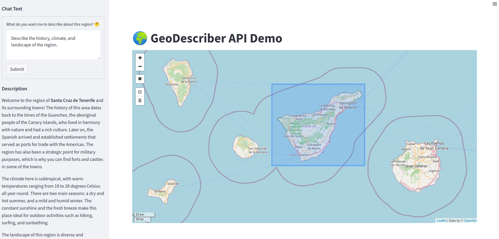

# GeoDescriberAI

This repository contains a Streamlit app where the user can select a region and provide description request. The app also uses the OpenStreetMap data and the OpenAI API for geodescribing the region.



## Installation

To use the app, follow these steps:

1. Clone the repository: `git@github.com:Vizzuality/GeoDescriberAI.git`
2. Change into the repository directory: `cd GeoDescriberAI`
3. Create a virtual environment: `python -m venv env`
4. Activate the virtual environment: `source env/bin/activate`
5. Install the required packages: `pip install -r requirements.txt`
6. Create a `.env` file with your OpenAI API key:

    ```
    OPENAI_API_KEY=your_openai_api_key
    ```

## Usage

To run the app, use the following command:

```
streamlit run app.py
```

This will launch the app in your default web browser.

1. Click the black square on the map
2. Draw a rectangle on the map
3. Provide your description request in the textbox below
4. Click on `Describe`
5. Wait for the computation to finish

## Contributing

If you find a bug or want to suggest a feature, please create a new issue on the GitHub repository. Pull requests are also welcome.


